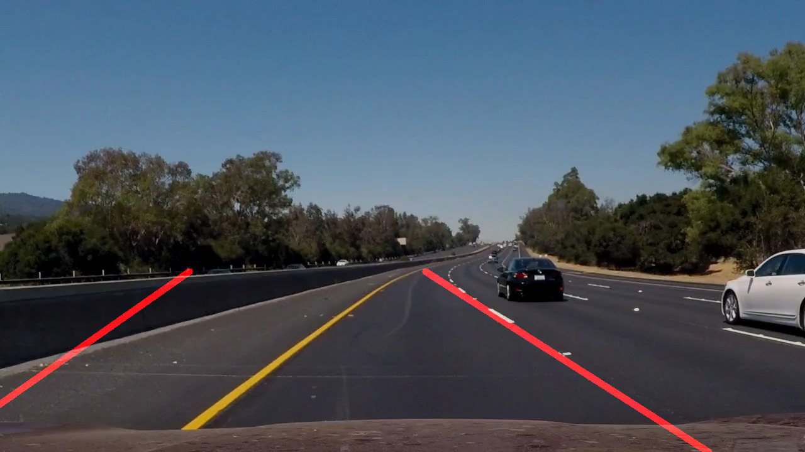

# **Finding Lane Lines on the Road** 

## Project 1

### You can use this file as a template for your writeup if you want to submit it as a markdown file. But feel free to use some other method and submit a pdf if you prefer.

---

**Finding Lane Lines on the Road**

The goals / steps of this project are the following:
* Make a pipeline that finds lane lines on the road
* Reflect on your work in a written report

[//]: # (Image References)

[image1]: ./examples/grayscale.jpg "Grayscale"

---

### Reflection

### 1. Describe your pipeline. As part of the description, explain how you modified the draw_lines() function.

My pipeline along with a sample output is as follows:

1) Read in the image using imread function and convert it to a gray scale image with only one channel.
2) Since the images are likely to have noise, I used the gaussian_blur method to average out the pixel intensities and reduce noise.
3) Apply the canny method to identify edges (sharp change in intensity between adjacent pixels) in the image using appropriate parameters (keeping the ratio of low threshold : high threshold as 1:3 as recommended). 
4) The next thing to do is to define a region of interest (as masked region) using vertices. There could be a lot of edges in the images but we want to restrict to only the part of the image which has lanes in it and ignore the rest.
5) Use the Hough transform with appropriate parameters and draw hough lines on the image.
6) Wrote additional function instead of changing the draw_lines function for averaging and extrapolating the lines obtained through Hough transform.
7) At last, display the averaged-extrapolated lines on the original image as annotations aand visually compare how precise they are.

## How did I modify the draw_lines function to compute average and extrapolation?
I ended up writng another helper function on my own to do the same. I started with two empty lists: left\_lane and right\_lane. Now I iterate over the lines obtained from the Hough transform and use numpy.polyfit() function to linearly fit the lines and get the line parametres like slope and intercepts(m,b) of all the lines. If the slope is negative, I append these paramters in the left\_lane list and similarly to the right\_lane list if the slope is positive. It makes sense because in the image frame, the y-axis is inverted and therefore if we march on the left lane we are moving in positive-x and negative-y direction and hence the slope should be negative and vice versa.

Next, I take the average of the line paramters (m,b) using the numpy.average function. Now to extrapolate I added another helper function where in I get the endpoints of the left\_lane and the right\_lane using the equation of a line and setting the extents in the x and the y direction. After getting the endpoints, I drew the lines using the cv2.line function.   

### 2. Identify potential shortcomings with your current pipeline

One potential shortcoming would be what would happen when the consecutive frames (images) in a video do not have lanes in it. As such the current status of the pipeline would not be able to handle such scenarios. 

Another shortcoming is to isolate lanes from other objects in the image. As demonstrated in the output video for challenge case. It is not able to handle the edges from the sides of the road. A snapshot from the output shows correct lane detection for the right lane but not for the left lane. This requires more work and better tuning of parameters for annotating accurately.

Another issue could be the lighting in the image. If the car drives through a tunnel. The lighting would be different and the lane detector might not work. It would take time to adjust to the new lighting and the transition might not be smooth resulting in abrupt and worryisome behavior.

### 3. Suggest possible improvements to your pipeline

A possible improvement would be to use better color detection like HSV channels.

Another potential improvement could be to ...
